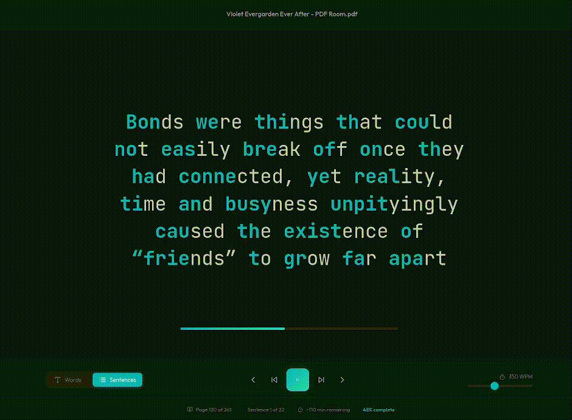

# Sezi 📖✨

A modern speed reading application for PDF documents. Read faster by eliminating eye movement across lines and leveraging bionic reading techniques.

> **Sezi** (Turkish: *sezi*) — intuition, foreboding, a sense of knowing. Read with flow.


<p align="center">
  
</p>

## 📥 Download

Download the latest version for your operating system:

| Platform | Download |
|----------|----------|
| Linux | [Sezi.AppImage](https://github.com/ali6parmak/sezi/releases/download/v1.2.5/Sezi-1.0.0.AppImage) |
| Windows | [Sezi Setup.exe](https://github.com/ali6parmak/sezi/releases/download/v1.2.5/Sezi.Setup.1.0.0.exe) |
| macOS | [Sezi.dmg](https://github.com/ali6parmak/sezi/releases/download/v1.2.5/Sezi-1.0.0.dmg) |

> **Note**: You need **Python 3.9+** installed on your system. Download from [python.org](https://python.org/) if you don't have it.

### ⚠️ Platform-Specific Notes

<details>
<summary><b>🍎 macOS Users</b> - "App is damaged" error</summary>

macOS may show "Sezi is damaged and can't be opened" because the app is not code-signed. To fix this:

**Option 1: Right-click to open**
1. Right-click (or Control-click) on Sezi.app
2. Select "Open" from the context menu
3. Click "Open" in the dialog that appears

**Option 2: Remove quarantine attribute**
```bash
xattr -cr /Applications/Sezi.app
```

**Option 3: Allow apps from anywhere (less secure)**
```bash
sudo spctl --master-disable
```

</details>

<details>
<summary><b>🪟 Windows Users</b> - SmartScreen warning</summary>

Windows may show a SmartScreen warning because the app is not code-signed:
1. Click "More info"
2. Click "Run anyway"

</details>

<details>
<summary><b>🐧 Linux Users</b> - AppImage permissions</summary>

Make the AppImage executable:
```bash
chmod +x Sezi-*.AppImage
./Sezi-*.AppImage
```

</details>

## ✨ Features

### Core Reading Features
- **Speed Reading Mode**: Content appears word-by-word or sentence-by-sentence at your chosen pace
- **Bionic Reading**: First portions of words are highlighted to guide your eyes naturally
- **Adjustable Speed**: From 50 to 800 words per minute (WPM)
- **Two Reading Modes**:
  - **Word Mode**: Individual words displayed one at a time
  - **Sentence Mode**: Complete sentences displayed sequentially

### Progress & Navigation
- **Auto-Save Progress**: Your reading position is automatically saved
- **Resume Reading**: Continue exactly where you left off
- **Navigation Controls**: Go to previous/next word, sentence, or page
- **Progress Tracking**: Visual progress bar and percentage complete
- **Time Estimation**: See estimated time remaining

### Customization
- **5 Beautiful Themes**: Midnight, Ocean, Forest, Sunset, and Paper (light mode)
- **Font Selection**: JetBrains Mono, Outfit, Crimson Pro, Georgia, or System font
- **Font Size**: Adjustable from 24px to 80px
- **Custom Colors**: Personalize text, background, and highlight colors

### User Experience
- **Recent Documents**: Quick access to your last 10 opened documents
- **Drag & Drop Upload**: Simply drag PDF files to open them
- **Keyboard Shortcuts**: Control playback without touching the mouse
- **Fullscreen Mode**: Distraction-free reading experience
- **Responsive Design**: Works on desktop and tablet

## ⌨️ Keyboard Shortcuts

| Key | Action |
|-----|--------|
| `Space` | Play/Pause |
| `←` | Previous word/sentence |
| `→` | Next word/sentence |
| `↑` | Increase speed |
| `↓` | Decrease speed |
| `F` | Toggle fullscreen |
| `Esc` | Exit fullscreen |

## 🎨 Themes

- **Midnight** (default): Dark blue background with orange accents
- **Ocean**: Deep blue with cyan highlights
- **Forest**: Dark green with emerald accents
- **Sunset**: Dark red with rose highlights
- **Paper**: Light mode with warm sepia tones

## 🛠️ Tech Stack

### Backend
- **FastAPI**: High-performance Python web framework
- **pypdf**: PDF text extraction
- **SQLite + aiosqlite**: Async database for progress storage

### Frontend
- **React 18**: Modern UI library
- **Vite**: Fast build tool
- **Framer Motion**: Smooth animations
- **Lucide React**: Beautiful icons

### Desktop App
- **Electron**: Cross-platform desktop framework
- **electron-builder**: App packaging and distribution

## 🚀 Development Setup

### Prerequisites
- Python 3.9+
- Node.js 18+

### Installation

1. **Clone the repository**
   ```bash
   git clone https://github.com/ali6parmak/sezi.git
   cd sezi
   ```

2. **Set up the backend**
   ```bash
   cd backend
   python -m venv venv
   source venv/bin/activate  # On Windows: venv\Scripts\activate
   pip install -r requirements.txt
   ```

3. **Set up the frontend**
   ```bash
   cd ../frontend
   npm install
   ```

### Running in Development

1. **Start the backend** (in one terminal)
   ```bash
   cd backend
   source venv/bin/activate
   python main.py
   ```
   The API will run at `http://localhost:51735`

2. **Start the frontend** (in another terminal)
   ```bash
   cd frontend
   npm run dev
   ```
   The app will open at `http://localhost:5173`

## 📁 Project Structure

```
sezi/
├── backend/
│   ├── main.py           # FastAPI application
│   ├── pdf_processor.py  # PDF text extraction
│   ├── storage.py        # Database operations
│   ├── requirements.txt  # Python dependencies
│   └── data/             # SQLite DB & uploaded PDFs
├── frontend/
│   ├── src/
│   │   ├── components/   # React components
│   │   ├── context/      # Settings context
│   │   ├── hooks/        # Custom hooks
│   │   ├── pages/        # Page components
│   │   └── styles/       # CSS styles
│   ├── package.json
│   └── vite.config.js
├── electron/
│   ├── main.js           # Electron main process
│   └── preload.js        # Preload script
└── README.md
```

## 🔧 Building from Source

Want to build the desktop app yourself? See [BUILD.md](BUILD.md) for detailed instructions.

Quick build:
```bash
# Clone and setup
git clone https://github.com/ali6parmak/sezi.git
cd sezi
npm install
cd frontend && npm install && cd ..

# Build for your platform
npm run build:win   # Windows
npm run build:mac   # macOS
npm run build:linux # Linux
```

Installers will be in the `release/` directory.

## 🔮 Future Improvements

- [ ] EPUB and TXT file support
- [ ] Cloud sync for progress across devices
- [ ] Reading statistics and analytics
- [ ] Text-to-speech integration
- [ ] Browser extension for web articles
- [ ] Mobile app (React Native)
- [ ] Import from URLs (articles, blogs)
- [ ] Highlighting and bookmarking
- [ ] Export progress and notes

## 📝 License

MIT License - feel free to use this project for personal or commercial purposes.

---

Built with ❤️ for faster reading
